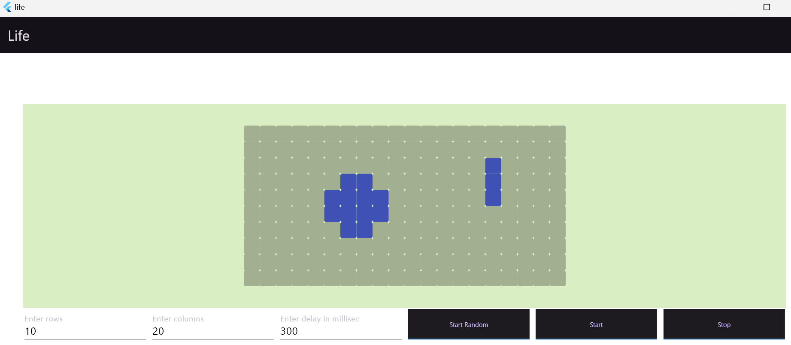

# life

Game of Life App in Flutter. Specify # of rows # of columns and a generation time in millisec. "Start Random" button starts with random cell values. To start with non random values, double click on the canvas area to toggle cell values. Then click "Start" button.

## Startup

## Code

The Life class includes a Timer to create the next generation of cells. The Bridge class uses an isolate to execute the life instance. When executed on web isolates are not used and Bridge creates a Life instance in the main isolate. Isolates are not needed in this case since the computaions are not time consuming, but the Bridge class shows some aspects of Isolates and is partly generic on the class it isolates. To make it completely generic and expose all functions of the backend class may be more involved, more so because the Isolate spawn function is static. A key aspect to using isolates to handle aync messages is to use completer. See https://dart.dev/language/isolates
